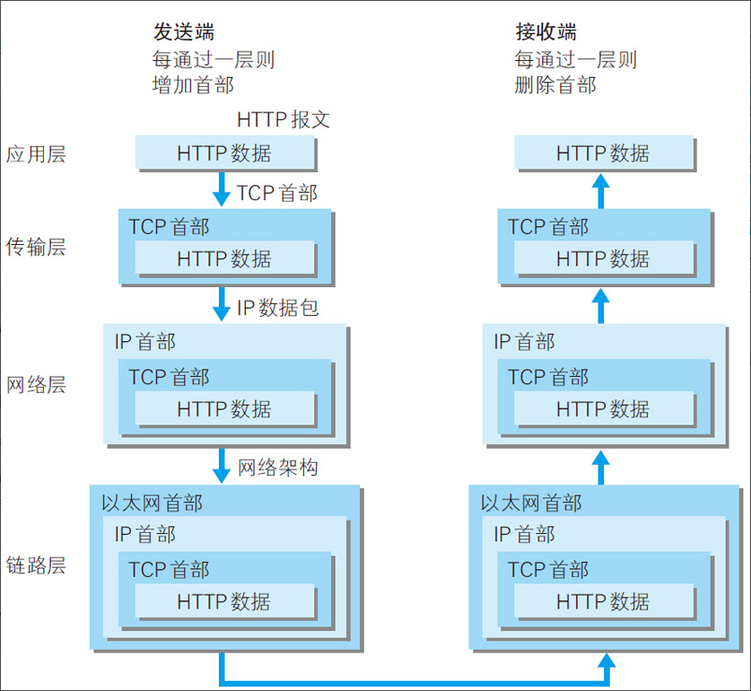

# 第一章 了解web和网络基础

* 通过发送请求获取服务器资源的Web浏览器等，都可称为**客户端（client）**

Web是建立在HTTP协议上通信的。

www的构建技术分别是：

  1. html超文本标记语言，页面的文本显示

  2. http超文本传输协议，信息传输转移的约定

  3. url统一资源定位符，客户端浏览超文本的地址集合

1995年微软公司发布Internet Explorer 1.0和2.0。

2004年，Mozilla基金会发布了Firefox浏览器，第二次浏览器大战随即爆发。

## 网络基础TCP/IP

通常使用的网络（包括互联网）是在TCP/IP协议族的基础上运作的。而HTTP属于它内部的一个子集。

TCP/IP是互联网相关的各类协议族的总称

### 分层管理

TCP/IP协议族按层次分别分为以下4层：

  应用层：FTP（File Transfer Protocol，文件传输协议）和DNS（DomainName System，域名系统）服务、HTTP协议
  
  传输层：对上层应用层，提供处于网络连接中的两台计算机之间的数据传输。TCP（Transmission Con-trol Protocol，传输控制协议）和UDP（User Data Protocol，用户数据报协议）。
  
  网络层：来处理在网络上流动的数据包
  
  数据链路层：用来处理连接网络的硬件部分
  
### TCP/IP通信传输流
  
  通过分层顺序与对方进行通信。发送端从应用层往下走，接收端则往应用层往上走。

  我们用HTTP举例来说明，首先作为发送端的客户端在应用层（HTTP协议）发出一个想看某个Web页面的HTTP请求。

  接着，为了传输方便，在传输层（TCP协议）把从应用层处收到的数据（HTTP请求报文）进行分割，并在各个报文上打上标记序号及端口号后转发给网络层。
  
  在网络层（IP协议），增加作为通信目的地的MAC地址后转发给链路层。这样一来，发往网络的通信请求就准备齐全了。
  
  接收端的服务器在链路层接收到数据，按序往上层发送，一直到应用层。当传输到应用层，才能算真正接收到由客户端发送过来的HTTP请求。

  发送端在层与层之间传输数据时，每经过一层时必定会被打上一个该层所属的首部信息。
  
  反之，接收端在层与层传输数据时，每经过一层时会把对应的首部消去。这种把数据信息包装起来的做法称为**封装**（encapsulate）。
  
  **负责传输的IP协议**
  
  IP（Internet Protocol）网际协议位于网络层
  
  IP协议的作用是把各种数据包传送给对方。而要保证确实传送到对方那里，则需要满足各类条件。
  其中两个重要的条件是**IP地址**和**MAC地址**（Media Access Control Address）
  
  IP地址指明了节点被分配到的地址，MAC地址是指网卡所属的固定地址
  
  **确保可靠性的TCP协议**
  
  TCP位于传输层，提供可靠的字节流服务
  
  TCP协议采用了三次握手（three-way handshaking）策略。
  握手过程中使用了TCP的标志（flag）——SYN（synchronize）和ACK（acknowledgement）。
  
  发送端首先发送一个带SYN标志的数据包给对方。
  接收端收到后，回传一个带有SYN/ACK标志的数据包以示传达确认信息。
  最后，发送端再回传一个带ACK标志的数据包，代表“握手”结束。
  
  
  **负责域名解析的DNS服务**
  
  它提供域名到IP地址之间的解析服务
  
  **统一资源标识符URI**
  
  URI用字符串标识某一互联网资源，而URL表示资源的地点（互联网上所处的位置）。可见URL是URI的子集。
  
  
  
  
  
  
  
  
